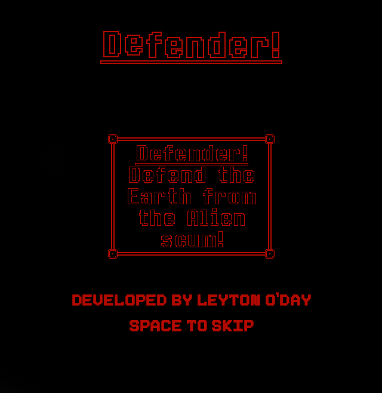
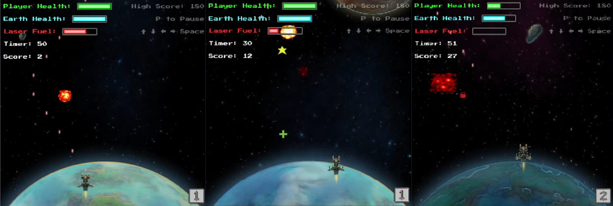

# Asteroids
A small game I made for University using Processing Java. This earned me a grade of 100%. I was one of only two students out of 
approximately 400 to earn 100% on this Unit. In preperation for this Unit, I read Java in a Nutshell by Benjamin J Evans and David 
Flanagan (see here: https://www.oreilly.com/library/view/java-in-a/9781492037248/). 

I followed the standards of JavaDoc to comment this whole project, so reading and following the code is easy and intuitive. 

See figures for examples of game play.

In this application, I implemented features such as:
- Animation
- Static entities
- Dynamic (animated) entities
- Audio management and manipulation
- A modular approach to implementing the game classes using interfaces. 

## Run Game
Note: the contents of this repository *must* be placed in a folder called "Main". 

This game was programmed using Java and Processing for rendering the graphics. Therefore, you must install 
Processing to run this game: https://processing.org/download/ 

Of course also, you must install the latest Java JDK to compile the Java code: https://www.oracle.com/uk/java/technologies/javase-downloads.html

Once both of these are installed, open Processing, select Java as the language, and open the "Main" folder, in which the 
contents of this repository reside. From there, go to File, Export Application. Select your operating system, and click "Export". 
This will compile the application for both 32-bit and 64-bit operating systems. 

## Figures
### Splash Screen

### Playing Images

## Contributing
Pull requests are welcome. For major changes, please open an issue first to discuss what you would like to change.

Contact me for general enqueries here: leytonodayabc123@gmail.com
